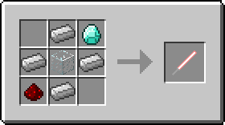
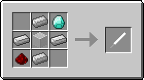
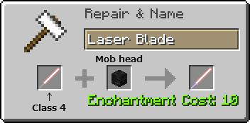
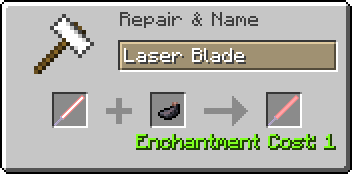
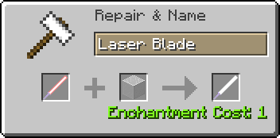

## ToLaserBlade アイテム解説

以下の解説は、バージョン 1.12.2-1.3.1.0 時点での仕様に基づいて書かれています。

### Laser Blade / レーザーブレード  (Prop / 模造品)

- タイプ：剣
- 攻撃速度：2.8
- 攻撃力：5
- 耐久度：255
- エンチャントテーブルで剣タイプのエンチャントが可能
- 耐久度が半分以上残っているとき、地面や壁を右クリックすると耐久度を消費してレッドストーントーチを設置する
- 耐久度が半分未満のとき、設置されたレッドストーントーチを右クリックするとそれを消費して耐久度を回復する
- 耐久度が半分以上のとき、設置されたレッドストーントーチを右クリックするとそれを回収する

### Laser Blade / レーザーブレイド

- タイプ：剣
- 耐久度：∞
- クラフト方法によって性能がクラス1～4まで変化する

#### クラス 1

 

- 攻撃速度：2.8
- 攻撃力：6
- 地上（オーバーワールド）の素材のみでクラフト可能
- 中央はガラスまたは色付きガラス。色付きガラスの場合はその色に応じて刃の周辺部分の色が変わる
- エンチャントテーブルで剣タイプのエンチャントが可能

#### クラス 2

- 攻撃速度：2.8
- 攻撃力：7
- エンチャントテーブルで剣タイプのエンチャントが可能

#### クラス 3

- 攻撃速度：4
- 攻撃力：10
- エンチャント：アンデッド特効 (Smite) V
- クラフトした時点でエンチャントされている

クラス1～2のレーザーブレイド（ただし未エンチャントに限る）は、以下のように金床を使ってクラス3相当に強化することが可能。

- 未エンチャントのレーザーブレイドの名前を金床で特定のワードに変更する
- ヒント：かな4文字［A5=お, T2U, A1L=か, W1R］

#### クラス 4

- 攻撃速度：4
- 攻撃力：14
- エンチャント：アンデッド特効 (Smite) X、範囲ダメージ増加 (Sweeping Edge) III
- 強化前のレーザーブレイドにアンデッド特効と相反するエンチャントが付いていた場合は、アンデッド特効で上書きされる

#### クラス 4+

- 金床でクラス4のレーザーブレイドとmobの頭を合成すると、攻撃力をさらに上げることができる。

#### 刃染色レシピ

- 単体クラフトすると刃の周辺部分の色がプレイヤーのいるバイオーム（多くはその基準温度）に応じて変化する
- 刃の色は全部で9色
- クラフトスロットからはマウスでドラッグして取り出すこと（Shiftクリックの場合は染色されない）
- クラフト後アイテムの情報が更新されるまでは何色に染色されたのかはわからない
- 性能はクラフト前のものが引き継がれる

- 金床で染料と合成するとその色に応じて刃の中心部分の色を変更することができる

- 金床で色付きガラスと合成するとその色に応じて刃の周辺部分の色を変更することができる

## ToLaserBlade 設定項目

- enableLaserBlade3DModel
  - 真偽値、デフォルトは`true`
  - レーザーブレイドの描画に、true：3D（OBJ）モデルを使用するか、false：2D（JSON）モデルを使用するか
  - この設定はクライアント側でのみ使われる
  - ゲーム内modオプションの設定GUIでも変更可能

---
Copyright 2018 Iunius118
