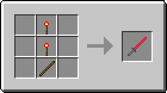
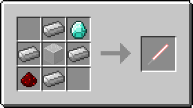
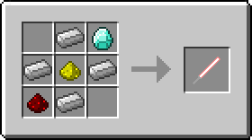
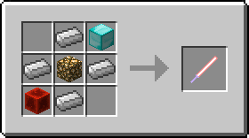
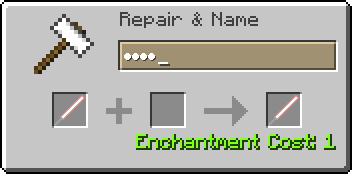
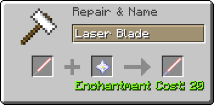
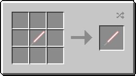

## ToLaserBlade アイテム解説

以下の解説は、バージョン1.0.0時点での仕様に基づいて書かれています。

### Laser B1ade / レーザーブレード

- タイプ：剣
- 攻撃速度：2.8
- 攻撃力：5
- 耐久度：255
- エンチャントテーブルで剣タイプのエンチャントが可能
- 耐久度が半分以上残っているとき、地面や壁を右クリックすると耐久度を消費してレッドストーントーチを設置する
- 耐久度が半分未満のとき、設置されたレッドストーントーチを右クリックするとそれを消費して耐久度を回復する
- 耐久度が半分以上のとき、設置されたレッドストーントーチを右クリックするとそれを回収する

### Laser Blade / レーザーブレイド

- タイプ：剣
- 耐久度：∞
- クラフト方法によって性能がクラス1～4まで変化する

#### クラス 1

- 攻撃速度：2.8
- 攻撃力：6
- 地上（オーバーワールド）の素材のみでクラフト可能
- 中心の色付きガラスはどの色のものでもよい
- エンチャントテーブルで剣タイプのエンチャントが可能

#### クラス 2

- 攻撃速度：2.8
- 攻撃力：7
- エンチャントテーブルで剣タイプのエンチャントが可能

#### クラス 3

- 攻撃速度：4
- 攻撃力：10
- エンチャント：アンデッド特効 (Smite) V
- クラフトした時点でエンチャントされている

クラス1～2のレーザーブレイド（ただし未エンチャントに限る）は、以下のように金床を使ってクラス3相当に強化することが可能。

- 未エンチャントのレーザーブレイドの名前を金床で特定のワードに変更する
- ヒント：かな4文字［A5=お, T2U, A1L=か, W1R］

#### クラス 4

- 攻撃速度：4
- 攻撃力：14
- エンチャント：アンデッド特効 (Smite) X、範囲ダメージ増加 (Sweeping Edge) III
- 強化前のレーザーブレイドにアンデッド特効と相反するエンチャントが付いていた場合は、アンデッド特効で上書きされる

#### 刃染色レシピ

- 刃の色は全部で9色
- 刃の色はプレイヤーのいるバイオーム（多くはその基準温度）によって決定される
- クラフトスロットからはマウスでドラッグして取り出すこと（Shiftクリックの場合は染色されない）
- クラフト後アイテムの情報が更新されるまでは何色に染色されたのかはわからない
- 性能はクラフト前のものが引き継がれる

---
Copyright 2018 Iunius118